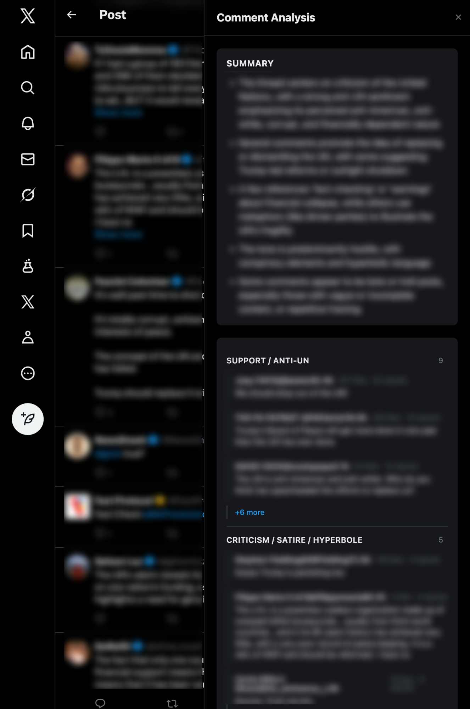
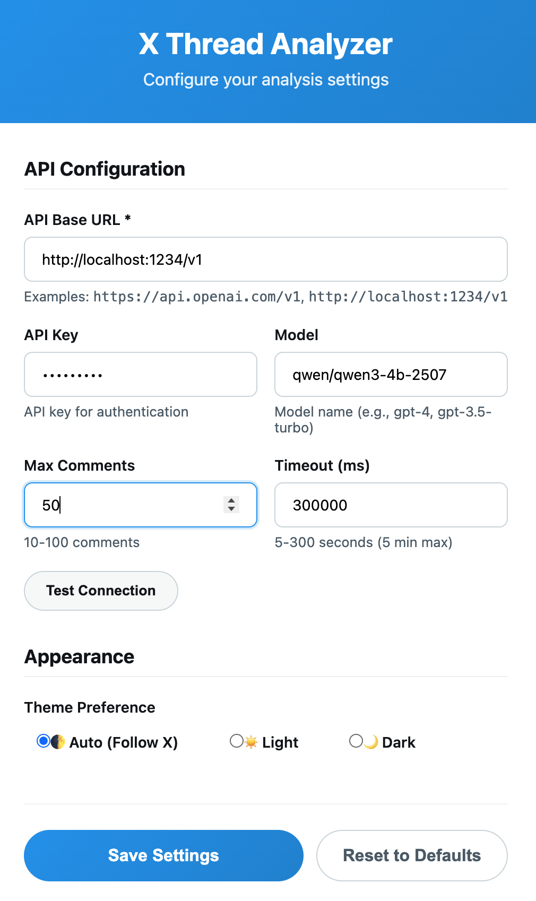

# X Thread Analyzer

Chrome extension to analyze X/Twitter threads using LLM. Summarizes, categorizes, and filters comments while identifying bots and trolls.



## Features

- 🔍 **Automatic Thread Detection**: Detects when you're viewing an X/Twitter thread
- 🤖 **One-Click Analysis**: Floating action button for instant analysis
- 📊 **Smart Comment Collection**: 
  - Scrapes visible comments only
  - Deduplicates using tweet IDs
  - Filters promoted content
  - Sorts by engagement (likes + reposts + replies)
  - Limits to top 50 comments for efficiency
- 🎨 **X-Native Design**: 
  - Follows X's design language
  - Automatic light/dark theme detection
- ⚙️ **Configurable Settings**:
  - API endpoint (supports OpenAI and compatible APIs)
  - Model selection
  - API key authentication
  - Comment limit (10-100)
  - Request timeout (5-120 seconds)
  - Theme preference (Auto/Light/Dark)
- 🔄 **Robust API Handling**:
  - Configurable timeout
  - User-friendly error messages
  - Progress bar during analysis
- 🔒 **Secure**: API key stored in Chrome's encrypted storage

## Quick Start

### Prerequisites
- Chrome 88+ or Edge (Chromium-based)
- Node.js 18+ and npm
- An OpenAI-compatible API endpoint (OpenAI, Azure, local LLM, etc.)

### Development Installation

1. **Clone and install dependencies**:
```bash
npm install
```

2. **Build the extension**:
```bash
npm run build
```

3. **Load in Chrome**:
   - Open Chrome and navigate to `chrome://extensions/`
   - Enable "Developer mode" (toggle top-right)
   - Click "Load unpacked"
   - Select the `dist/` folder from this project

4. **Configure the extension**:
   - Click the extension icon in Chrome toolbar
   - Select "Options"
   - Enter your API details (see Configuration section below)
   - Click "Test Connection" to verify
   - Click "Save Settings"

5. **Use the extension**:
   - Navigate to any X/Twitter thread (e.g., `x.com/username/status/123`)
   - Click the floating "Comment Analysis" button (bottom-right)
   - View analysis results in the sidebar

## Configuration

### API Endpoint Setup

The extension works with any OpenAI-compatible API, local or remote:

**Local LLM (e.g., using Ollama or similar)**:
- API Base URL: `http://localhost:1234/v1`
- API Key: (leave empty if not required)
- Model: Model name your local server expects

### Settings Fields

- **API Base URL**: The base URL for your API endpoint
- **API Key**: Authentication token (if required)
- **Model**: AI model name
- **Max Comments**: Number of comments to analyze (10-100, default 50)
- **Timeout (ms)**: API request timeout in milliseconds (5000-120000, default 30000)
- **Theme**: UI theme preference (Auto/Light/Dark)

## Development

### Available Scripts

```bash
# Start development server with hot reload
npm run dev

# Build for production
npm run build

# Type check only
npm run typecheck

# Preview production build
npm run preview
```

### Project Structure

```
x-thread-analyzer/
├── docs/                      # Documentation
│   ├── REQUIREMENTS.md       # Detailed requirements
│   ├── ARCHITECTURE.md       # Architecture decisions
│   ├── IMPLEMENTATION.md     # Implementation guide
│   └── ROADMAP.md           # Development roadmap
├── src/
│   ├── manifest.json         # Extension manifest (entry point)
│   ├── background/           # Service worker
│   │   └── service-worker.ts # API proxy with retry logic
│   ├── content/              # Content script (runs on X.com)
│   │   ├── main.ts          # Entry point, mounts Vue app
│   │   ├── App.vue          # Root component, theme provider
│   │   ├── components/      # Vue UI components
│   │   │   ├── AnalyzerButton.vue    # Floating action button
│   │   │   ├── SidebarPanel.vue      # Fixed sidebar with progress
│   │   │   ├── AnalysisResults.vue   # Results display
│   │   │   ├── CommentCategory.vue   # Collapsible category
│   │   │   └── LoadingState.vue      # Loading skeleton
│   │   ├── composables/     # Reusable Vue logic
│   │   │   ├── useXTheme.ts         # Theme detection
│   │   │   └── useThreadAnalyzer.ts # Analysis orchestration
│   │   └── styles/
│   │       └── content.css  # Scoped styles with CSS variables
│   ├── options/             # Extension settings page
│   │   ├── index.html       # Options page HTML
│   │   ├── main.ts          # Options entry point
│   │   ├── App.vue          # Options layout
│   │   └── components/
│   │       └── SettingsForm.vue # API configuration form
│   └── types/
│       └── index.ts         # TypeScript interfaces
├── dist/                    # Build output (load in Chrome)
├── icons/                   # Extension icons
├── package.json            # Dependencies and scripts
├── vite.config.ts          # Vite + CRX configuration
├── tsconfig.json           # TypeScript config
└── README.md               # This file
```

### Technology Stack

- **Build Tool**: Vite with @crxjs/vite-plugin
- **Framework**: Vue 3 (Composition API)
- **Language**: TypeScript
- **Extension**: Chrome Manifest V3
- **Styling**: Scoped CSS with CSS variables
- **Storage**: Chrome Storage Sync API

## Troubleshooting

### Extension Not Loading
- Ensure `dist/manifest.json` exists after building
- Check that you've selected the `dist/` folder (not the project root)
- Verify Developer mode is enabled in Chrome

### CORS Errors
If you see errors like:
```
Access to fetch at 'http://localhost:1234/v1' from origin 'chrome-extension://...' has been blocked by CORS policy
```

**Solution**: The API domain must be in the extension's `host_permissions`. For local development, `http://localhost:*/` is already included. For production APIs, add your domain to `src/manifest.json`:
```json
"host_permissions": [
  "https://x.com/*",
  "https://twitter.com/*",
  "http://localhost:*/",
  "https://api.yourdomain.com/*"
]
```

After modifying the manifest, reload the extension in Chrome.

### API Connection Failures
- **401 Unauthorized**: Check your API key
- **429 Rate Limited**: Wait a moment and try again
- **Timeout**: Increase the timeout setting (some APIs take 30+ seconds)
- **Network Error**: Verify the API endpoint URL and that the server is running

### Comments Not Found
- Ensure you're on a thread page (URL should contain `/status/`)
- Make sure comments are visible (scroll down to load more if needed)
- Check that the thread has replies (not just the original post)

## API Format

The extension sends requests in OpenAI chat completions format:

### Request
```json
{
  "model": "gpt-4",
  "messages": [
    {
      "role": "system",
      "content": "You are an expert at analyzing social media comments..."
    },
    {
      "role": "user",
      "content": "Analyze these 50 comments from an X/Twitter thread:\n\n1. Author: \"Comment text...\"\n2. ..."
    }
  ],
  "temperature": 0.7,
  "max_tokens": 2000
}
```

### Expected Response
The API should return a JSON response that the extension will parse. The response can be either:

**Standard OpenAI format**:
```json
{
  "choices": [{
    "message": {
      "content": "JSON string with analysis results"
    }
  }]
}
```

**Direct JSON format**:
```json
{
  "summary": "Thread summary text",
  "categories": [
    {
      "name": "Support",
      "icon": "👍",
      "comments": [...]
    }
  ],
  "filteredCount": 5,
  "analyzedCount": 45
}
```

## Development Roadmap

See [docs/ROADMAP.md](docs/ROADMAP.md) for detailed development phases.

**Current Status**: Phase 2 Complete, Phase 3 (Testing) In Progress

### Completed Features (Phase 1-2)
- ✅ Core extension structure
- ✅ DOM scraping with deduplication
- ✅ API integration with retry logic
- ✅ Progress tracking
- ✅ Error handling with retry
- ✅ Settings page with test connection
- ✅ Model selection
- ✅ Smart URL handling

### Planned Features (Phase 3-4)
- 🔄 Comprehensive testing
- 📋 Resizable sidebar
- 💾 Historical analysis storage
- 📤 Export results (JSON/PDF)
- ⌨️ Keyboard shortcuts
- 🎨 Custom themes

## Documentation

- [Requirements](docs/REQUIREMENTS.md) - Detailed functional and non-functional requirements
- [Architecture](docs/ARCHITECTURE.md) - Architecture decision records (ADRs)
- [Implementation](docs/IMPLEMENTATION.md) - Implementation details and data flow
- [Roadmap](docs/ROADMAP.md) - Development phases and future plans

## License

MIT License - see LICENSE file for details

## Support

For issues, questions, or feature requests:
1. Check the [troubleshooting section](#troubleshooting) above
2. Review the [documentation](#documentation)
3. Open an issue on GitHub

---

**Note**: This extension is not affiliated with X Corp. It is an independent project for educational and research purposes.